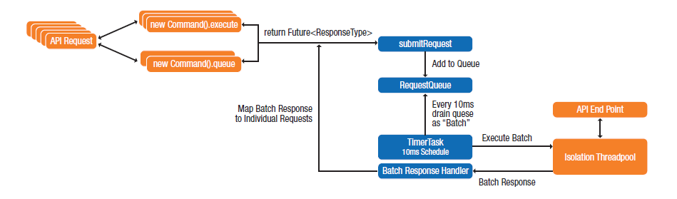

# Architecting Cloud-Aware Applications

[toc]

## 简介

为了更有效的利用云计算的潜力，企业必须从根本上改变开发和运维的方式。在这种新的计算模型上采用新的开发方式才能更好地获得云计算全方位的好处。在云计算下，应用的构建、运行和使用方式都和以往大大不同，这些不同导致需要新的思考模式以及了解一定新的设计模式才能取得最好的结果，这些和传统的解决问题时的权衡方式是有所不同的。

本文档为专注于应用架构和开发实践的开发人员提供了一个视角：从多个层面构建可以利用云的独特能力的应用程序的体系架构。

为了更有效的过渡到云计算，开发者需要：
- 了解基于云计算的新的设计范式，区别它和传统的计算平台在软硬件上存在的基本差异。
- 熟悉和使用能够构建更好的云应用的基础软件设计模式。
- 发展和完善技能，针对云计算的范式进行转型。

## 摘要

为了跟上日益普及的云计算，开发人员必须在开发基于云计算的应用架构时考虑云的基本特征。虽然开发人员很容易地将原来的分布式软件部署在云上，但是这种从物理到虚拟化（physical-to-virtual，P2V）的简单移植并不能发挥出云计算的独特能力。使用明确为云环境所设计的设计模式，可以让软件保持高水平的可靠性、增强的安全性和弹性。

本文为开发人员所写：
- 总结了云计算应用程序体系架构的基本原理；
- 介绍了云计算应用程序的结构原理；
- 提出了一些已经被证明有效的云计算架构案例的设计模式；
- 提出了云计算应用程序的关键运维原则，通过云应用成熟度模型帮助企业进行云应用的演进。

开发人员、架构师、CTO、CIO等都可以通过本文介绍的云应用开发技术中受益！

## 目标读者

本文主要贡献给软件软件开发社区，同时为任何在云上构架、设计、实施、部署和运维服务的人员提供有价值的信息。
目标受众有：
- 参与设计、开发和部署云应用程序的软件开发者；
- 为企业进行云应用设计和部署的企业决策者；
- 负责规划、运营和采购的企业IT组织；
- 致力于提高云平台的互操作API和云计算相关的标准和指南的标准组织；

## 术语

在本文档中，“云应用（cloud application）”这个词指的是一组在云中托管的组件（components）的集合，同时连同一些在设备或者浏览器中运行的客户端应用（client app）。例如，一个用户可能使用iPad中的视频播放器观看电影，但这取决于在云中运行的身份验证、授权、媒体流、媒体存储、缓存和其它服务组件，总的来说这些构成了一个完整的“云应用程序”。但是本文只关注于托管在云端的组件部分。

## 应用程序架构的演进

随着计算机硬件、网络以及设备从个人电脑到智能手机的变化，应用程序架构也随之演进。云计算是最近的改变应用程序架构演进的力量。要了解云计算如何改变软件架构，需要看看在传统的非云环境中软件架构是什么样子的。

### 分层体系架构

分层体系架构（见下图）将应用程序的功能分布在不同的层中。例如，在三层架构中：
- 表示层提供用户接口；
- 中间层处理从客户端过来的用户请求，完成应用的商业逻辑；
- 数据层提供应用的数据存储；

电子邮件应用程序就是典型的三层架构。这种类型的应用包含一个表示层客户端，例如运行在PC上的Outlook，一个中间层的消息服务器（Exchange Server），以及一个后端信息存储。中间层以API的形式对外提供接口。客户端使用这些API和中间层通讯，使用一个应用协议，如互联网信息访问协议（IMAP）。中间层往往与多个后端服务进行交互。在电子邮件系统中，中间层可能与后端的目录服务、消息存储、消息转发代理等等进行集成。

分层体系架构中的每一个组件通常都运行在各自独立的服务器上，层之间通过静态配置其依赖的服务器主机名来进行互通。这种分层架构往往比单体架构（monolithic architecture：即不做分层，把整个应用构建在一起）有更多的优势。分层架构中每一个组件都可以独立运行并且层之间可以提供负载均衡以便获得更好的性能和可靠性。因为中间层通过网络API的方式进行访问，所以多个客户端可以共享一个中间层服务器。每个层都可以独立开发，只要接口和数据保持兼容。

在多层架构中，服务的部署是静态的，会按照部署的方式将不同服务打包进行开发和设计。层之间的依赖通过上电时的配置文件进行描述。例如：一个邮件客户端通过配置文件知道邮件服务器的主机名和IP，客户端无法动态发现离自己最近的邮件服务器，它必须通过已知的主机名直接连接到服务器。

多数的网络应用也都是分层体系架构的例子。一个网络服务器向用户的网页浏览器分发应用代码和内容，用户侧JavaScript代码执行渲染为用户提供交互式体验。中间层的服务器上往往运行Java、Ruby on Rails或者PHP等代码为前端用户交付动态内容，反过来中间层需要与后端的数据库服务进行通信。

### 基于虚拟化环境的分层体系架构

许多企业已经将他们的应用迁移到自己的数据中心的虚拟化技术设施上。在虚拟化环境中，应用组件是部署在虚拟机上而非传统的物理硬件上。虚拟化可以让可用的计算资源更有效的被利用，通过自动化手段减少供应时间和成本，从而提高效率。

在虚拟化环境中，应用的部署和配置和其在物理数据中心是相同的，例如都是通过静态配置来构建的。然而，虚拟化可以让应用程序更高效的扩展，因为新的应用组件实例可以按需创建和配置。这种动态性可以通过基于虚拟化的负载均衡和虚拟IP（VIPs）来实现。分层架构中的每一层都可以独立的进行扩展，而对其它层是透明的。

### 云应用架构

为云创建应用程序时，开发人员可以不改变他们原来架构应用程序的方式。例如：一个开发人员可以简单地把一个分层架构的应用部署到云基础设施上，特别是使用基础设施即服务（IaaS），可以方便地把原来基于独立服务器的应用组件直接移植到对应的虚机（VM）上。然而，这种P2V的方式，并不能很好的让应用程序发挥云的独特功能。传统分层架构，通常和特定的基础设施位置，例如服务器名称、IP地址、以及网络服务配置等强耦合。这种方式使得它基本难以在云上进行快速的多虚机或多实例自动扩展。为了更有效的发挥云的全方位能力，开发人员必须在架构设计的时候全面考虑云环境特点，包括弹性、自服务、和多租户等。下图对别了传统的分层架构和基于云架构应用的差异。

一般情况下，使用云平台的应用程序需要满足分布式系统的约束要求。Peter Deutsch在1994年描述了开发人员在开发分布式系统时经常犯的8大谬误。这些谬误适用于跨网络的分布式服务系统，包括今天的云架构应用。针对这些谬误，Peter Deutsch提出了一些构建分布式系统的原则和最佳实践，这些最佳实践可以有效指导如何进行基于云架构特点的应用架构。

## 云应用架构原则

本节总结了云计算应用架构的基本原则。下表（表1）列出了影响应用程序进行组织、编码以及用户交互方式的结构性原则。后面表3还总结了整个系统的部署、运维以及与其它系统组件进行交互的操作原则。

这些原则适应于应用架构在不同时间的特定上下文，原则中标记为高优先级的属于开发云计算应用时强烈推荐的，低优先级相对来说重要性下降。

### 结构原则

本节详细介绍了云计算应用程序的结构原则。这些原则用来指导应用程序如何组织、编码以及与最终用户进行交互。

#### 容忍失败

在一个大规模的云环境中，应用程序运行的基础设施容易由于某些固定类型的故障导致无法正常操作。这里潜在的安全漏洞包含计算、网络或者存储的硬件失败，或者组件及服务的软件错误，或者由于某个反应迟钝的组件导致的网络失败，或者瞬间网络连接的中断等等。为了适应这些类型的故障，应用程序的架构设计必须能够设计得无缝处理它们并且继续通过降低性能层次或者优雅的降级功能的方式无干扰地继续运行。

松耦合可以最大限度地减少组件之间的依赖关系，使组件被替换而不影响别人。例如，我们很可能决定将key-value存储用一个更高性能和可靠性的实现来替换。松耦合同时提供了一种管理失败和延迟的方式，一个给定的组件可能会失败，但是由于不静态绑定到固定的实例，可以将失败的组件进行动态替换避免了应用程序从失败中恢复所需要做的操作。

开发人员经常忽视对网络可靠性问题进行弹性设计的重要性。此类型的失败是很检测以及优雅处理的。例如，如果关键数据由于访问问题不能被写入数据库，这时代码如何优雅地去处理该问题？可能有人争论说如果网络挂掉了后果如此严重，那么最简单的办法就是应用程序返回失败，让用户后续再次尝试。照他们使用移动设备的经验，用户应该知道网络不是100%的可靠。但是在云计算中忽略对失败的弹性设计，会导致大型分布式应用中单点失败的级联，最终造成整个系统服务的失败，而不只是仅仅对某一个用户带来不便。

在某些场景下，间歇性故障是可以接受的。通过网络负载均衡功能可以减少多种类型的失败，提高弹性和性能。然而，在其他情况下未能优雅地处理网络问题可能产生不能接受的用户体验。想象一下如果乘客无法进入地铁站是由于远端的服务的网络中断导致旋转门无法确认乘客的车票。再想象一下一个游戏无法启动是由于不能和排分服务建立连接（该服务并是不游戏启动的必须条件）。这些不可接受的后果，以及由于网络问题导致的级联后果，使得架构师必须考虑整个系统的整体视图。

> 系统必须在存在失败的情况下也能够持续响应，分布式系统要设计的可以容忍其所依赖的其它系统的失败。
> 如果系统down了，我们可以降低对客户的响应质量，但是还应该能够响应。如果我们系统的搜索部分变得缓慢，但是流媒体还是应该继续正常工作。
> - John Ciancutti, Netflix Tech Blog: “5 Lessons We’ve Learned Using AWS”

对云计算所设计的应用程序必须可以以多种形式容忍基础设施的失败。

> 法则： 做一个悲观主义者，当基于云做架构设计时，必须假设所有事情都可能失败。换句话说，总是设计、实现以及部署使得应用程序可以从失败中自动恢复过来。
> 特别是，假设你的硬件将会故障。假设会发生当机，假设应用程序会发生故障，假设某一天会遭受信令风暴，假设你的软件会随着时间发生失败。通过一个悲观主义者，你可以在每次设计的时候都去考虑恢复策略，这可以让你的系统整体设计的更好。
> 如果你意识到事情会随着时间推移而失败，把这种思想融入到你的架构设计中，建立机制来通过一个可扩展的架构在灾难爆发之前进行失败处理，你将最终建立一个适合云的容错架构。
> - Jinesh Varia, Technology Evangelist, Amazon: “Architecting for the Cloud: Best Practices”

#### 容忍延迟

云应用程序通常运行在一个多租户、共享的环境中。由于同环境中其它应用产生的负载通常会让网络的响应时间和延迟变得不稳定。云应用必须设计的能够妥善处理时延。云应用的开发者需要为时延专门进行弹性设计。由于基础设施故障导致的连接时延通常会有多种形式，包括：
- 网络拥塞或者网络分区；
- 对基础设施中的共享资源出现竞争请求；
- 存储系统出现I/O带宽饱和；
- 共享服务出现软件故障；
- DoS攻击导致服务失败或者资源枯竭；

移动应用程序（mobile application）的开发人员已经开发了用于解决不可靠网络连接的技术，这些技术同样适应于云。例如：
- 用队列缓存请求。实现一个请求队列和重试机制来确保请求不会丢失，这样可以确保应用程序状态不会出现崩溃。不需要在所有情况下都进行重传，例如，可以允许请求超时，如果下次应用程序主动向服务poll数据时数据是有效的。而对于写入请求则不应该进行丢弃。
- 优雅地处理失败。如果失败发生了，需要温和地处理它。例如，不要因为一个服务响应慢而导致应用程序阻塞，相反可以返回响应表明请求的进度。

延迟是所有分布式网络系统的一个重要性能指标。光的速度决定了两个网络节点之间的最小时延。在最好的情况下，一个运行在旧金山和另一个运行在纽约之间的服务通讯延迟也需要13.8ms，或者往返27.6ms。在现实中，延迟比这个还要高，由于网络链接降低信号传播速度、网络协议栈开销以及网络交换机和拥塞引起的时延。根据AT&T的测量，在旧金山和纽约之间的时延有70ms。

延迟随着时间会发生变化，这些取决于网络流量和路由。当应用托管在第三方云基础设施上，这对开发者是缺少控制权的，云提供商的网络情况以及其他用户如何使用云都是不透明的。由于数据中心中流量的情况非常复杂较难控制，所以云环境中的延迟变化会非常明显。

> AWS被设计为共享资源的模型。其中包括硬件、网络以及存储等都是多租户的。这样网络的吞吐是在不同层次间变化的。你要么愿意放弃任何特定的子任务，要么就在AWS下管理好你的资源避免多租户对你的影响。
> - John Ciancutti, Netflix Tech Blog: “5 Lessons We’ve Learned Using AWS”

分布式系统中往往具有大量节点，延迟可能会有服务之间的依赖进行累积，例如A依赖于B，B依赖于C，这样一个深的依赖栈会导致响应延迟大从而难以扩展。定位及解决这些服务依赖可以改善性能。当在云中架构应用时，开发者需要减少服务的嵌套层次，并确保依赖于时间的任务不会穿越较深的服务栈。例如，数据存储的API提供了一个写入操作保证提交操作最终可以写完成。应用发出写命令后就可以继续处理其他任务而不用等写入存储完成，当然应用在这期间要能够处理存储数据和程序状态不一致的问题，否则，就会引起用户的二义性。

减少网络请求的数量有利于管理时延。设计精简信令的交互协议，尽量一次获得所需的数据，而不是多次交互积累数据。例如：不要一次请求用户的ZIP码，一次请求用户的电话号码，改成在一次请求中获取所有用户联系信息。

> 在Netflix的数据中心中，我们的网络容量很大，速度很快而且高可靠，所以我们设计了很多和远端系统频繁交互的协议API。而AWS网络中时延变化幅度很大，这时我们就必须从结构上考虑尽量减少网络交互，即使我们已经是一个高分布式系统。
> - John Ciancutti, Netflix Tech Blog: “5 Lessons We’ve Learned Using AWS”

这种方式也有一定局限性，那就是在单一响应中增加有效负荷，提高了对带宽的使用。

另一种解决方案是使用节点间或者节点上的缓存。利用缓存，可以减少网络上请求的数量。缓存的另一个好处是如果所依赖的节点由于网络问题变得不可靠，如果设计得当，服务借助缓存中的数据仍然可以继续运行。

#### 安全

无论应用是否在网络上开放，安全都无处不在！企业间和公共网络环境中的连接越来越多，应用和服务也越来越变得对外开放。应用中的数据传输需要被加密，包括在存储时也应该是密文的。应用需要实现安全认证和授权访问控制，开发者需要掌握安全编码的一些实践。

在有防火墙保护的数据中心，开发者认为网络是相对安全的，所以在数据中心中的通讯不用加密，只需要关注和用户应用程序以及web浏览器之间的安全通讯。但是对一个云托管应用程序，应用程序和后端组件之间没有防火墙保护，即使这些组件不需要对外部开放，由于本身处于一个多租户环境中，安全也是没有保证的。如果网络是不能信任的，那么开发者就必须对应用的通讯以及开放的API进行安全设计。

即使在私有云下部署的应用，开发者也不应该低估安全的重要性，因为应用课程日后过度到公有云或者混合云上。安全设计应该作为全流程的考虑，而不应该知识一种事后补充。
- 传输数据安全。分布式应用依赖网络来发送请求以及接受响应。数据在网络中传输的完整性和安全性需要被保护。正如在公共互联网上传输敏感信息要使用安全协议一样，开发者在云环境中也应该采用同样的方法。网络安全协议，如SSL和HTTPS用于放置网络监听以及中间人攻击。基本上云上的所有网络通信都应该有安全保护。
- API访问控制。应用组件和服务暴漏的API必须被保护。通过使用API管理解决方案，例如使用OAuth来授权和控制对API的方式。利用这些手段，开发人员可以控制API和它的消费者之间的沟通，支队认证的客户授权。不幸的是API管理并不是大多数公共云所提供的标准特性，开发者必须自行实现自己的安全访问控制（类似OAuth）。
- 数据存储安全。如果网络是不安全的，那么通过网络访问进行数据存储也是有风险的。应该程序需要保证敏捷数据写入存储时是加密的。云服务商可以提供存储加密服务，以保证存储数据被第三方访问的安全性。但是如果秘钥是由云提供商保管，那么可能会保护不足。尤其需要保护个人身份信息，确保信用卡信息以及敏感的个人健康信息不被泄露。

只有在网络通讯，访问和数据都在控制之下，应用程序才能在云中安全的运行。

#### 位置无关

云托管应用程序和传统应用最重要的一个区别可能就是在云中网络拓扑肯定是会发生变化的。例如，云运营商可能会动态改变网络路由以减少拥塞。一个共享的服务可能会被移动到另一个区域的心虚拟机上，或者由于云的拥塞导致应用程序的组件被分散在多个云提供商的网络上。

如果对应用程序的配置进行了地址硬编码，这将会使应用程序非常脆弱，不能很好地适应变化，并会限制应用自动弹性伸缩的能力。

在云环境下服务或者组件的实例会随着时间而变化，要充分利用云环境的能力，应用程序需要设计的可以在这种动态的环境中进行运行。在这种环境下，应用程序不能假设哪些请求应该由哪些固定的服务进行响应，以及不能假设这些服务的网络位置。随着负载的增加，新的实例被弹性伸缩创建出来以适应负载。云服务供应商提供自动弹性伸缩的功能用来根据负载监控按照开发人员制定的规则添加或者删除实例。结合自动弹性伸缩，负载均衡可以自动分发负载到新的实例上或者让有问题的实例下线。

开发人员应该设计程序的架构来支持云的动态特性。一些最佳实践如下：、
- 不应该有硬编码的配置信息（例如服务的静态IP地址）。可以实现一个发现服务，应用组件可以向它动态查询给定服务的地址。
- 应用组件应该是无状态的，对应用的当前状态一无所知。这是一个实例由于弹性伸缩被销毁不会有任何数据损失。相反，当一个新的实例被启动时，它不应该决定当前的程序状态。
- 应用程序可以试用例如HTTPS这类协议，让组件间松耦合。
- 应用程序应该在设计上利用云基础设施提供的自动弹性伸缩功能。

在运维上，考虑下面的建议：
- 利用API代理去屏蔽最终的API接口，使消费者免受API接口的变化。

#### 弹性扩展

弹性是云计算的基本原则。弹性使得应用程序能够根据负载的变化自动伸缩。这种可扩展性使得对基础设施的利用率更高。应用程序必须进行专门设计才可以支持灵活的可伸缩性。简单地把应用部署到云上并不会获得弹性扩展的能力，为了得到该能力组件需要设计的小，并且无状态。

#### 面向服务架构/组合能力

动态发现的能力使得应用程序可以动态定位组件，而不是静态绑定到某一固定实例上。这种能力对于云中的组件来说十分重要，因为在云中各种各样的组件实例，故障是常见的，所以随时会有新的实例弹出来。通过这种发现能力，新的组件启动无需更改任何配置就可以进行负载处理。避免组件具有持久状态对该方面也有所帮助。

将应用程序分解为许多职责单一的组件，有利于重用、弹性伸缩以及支持敏捷开发。例如，将原来单一的消息存储组件拆分成更小的消息处理组件、消息检索组件和消息查询组件等。通过这种方法，对消息查询组件的改进可以不影响其余的消息组件的代码。

#### 可管理性设计

在云环境中，应用程序依赖于基础设施和云服务提供商所管理的服务。通常情况下，提供商的目标与开发人员的目标一致，都想要提供可靠的服务和保证其高可用。然而，提供商并不为开发人员的程序负责。提供商专注于整个共享云服务的整体可用性。例如，云提供商可能关闭某些服务，故意让网络分区以隔离故障，或者在排除故障的过程中故意让基础设施出现错误。所有这些都会影响到开发人员的应用程序。不幸的是，应用程序的所有者并不会拥有云管理员的控制权限，也不会获得像在自己的数据中心运维团队的运维细节，也没有对解决方案和升级方案的发言权。

鉴于云管理员并不会为开发人员的应用程序来管理和优化基础设施，所以应用程序的所有者需要自行对其管理。这要求开发人员了解云基础设施中正在发生什么。一种方式是编写代码深入可视化云基础设施内部的问题，例如缓慢的请求或者服务超时。通过这些确保应用程序的所有者可以获得管理和监控数据，以便对基础设施中的错误主动响应。

监控程序可以让程序行为的各个方面可视化，包括性能、故障、资源消耗以及用户事务等。这些监控数据可以让应用程序更容易维护、支持以及在高度动态的环境中进行问题定位。这些数据应该被记录下来以便定位人员分析问题，或者分析用户行为以 提高应用程序的用户体验。

一般云中会托管许多应用，它们依赖由相同组织提供的共享服务，很可能最终每个服务都有其管理员对其管理。

#### 基础设施解耦

与技术设施解耦是一个一贯推荐的软件工程实践。在云环境中使用云供应商提供的特有接口会导致软件锁定到固定的云供应商，这会导致软件难以或者不可能运行在其它云平台上。通过建立一个基础设施抽象层，可以让你更换底层服务的实现时无需重新应用程序的代码。

在数据中心中，异构性是很普遍的。一个应用服务可能运行在Linux虚拟机上，同时依赖一个运行在windows服务器上的数据库。开发人员根据它们开发和运行的需求来选择应用的平台，系统工程师通常在异构的环境中为不同类型的服务提供标准的配置。

云环境经常是多种多样的，它们提供一组虚拟机镜像，预先配置了特定的操作系统和软件。不幸的是，默认的镜像可能并不符合应用程序的要求。例如，一个Windows镜像可能并没有满足SQL Server要求的操作系统补丁。依赖于某一镜像可能会导致不可移植性，因为不同云提供商之间的镜像可能会存在不一致。这种镜像间微小的差异看似问题不大，但是却很可能引起应用程序运行时错误。

针对镜像的不一致化问题的解决方案是为应用提供自定义镜像，有以下一些可以采用的方式：
- 在确定的环境下，根据组件的需要提供精确化自定义的虚拟机镜像；
- 提供一个通用镜像，然后根据启动时的配置让镜像自行定制；
- 提供一组与应用程序匹配的基础设施配置的首选项，提供给管理员以便他可以为应用程序定制合适的基础设施配置；

运行时自配置可以让应用通过类型patch的方式让实例保持最新的配置，甚至可以个性化配置。例如，实例从标准的Linux镜像启动，然后进行安全配置加载，之后更新到特定版本的Java，随后配置与Java版本适合的容器，每一个配置都在前一个的基础上动态进行。这种运行时配置的缺点则是它会在弹性伸缩的时候加长实例的启动时间，造成性能上的影响。

由于广泛采用TCP作为互联网的标准传输协议，将下层的网络异质性进行了屏蔽。应用层的协议如HTTP又提供了进一步的抽象。流行的REST模式建立在HTTP智商，提供了一套方便的通过JSON或者XML更轻量级数据传输协议进行资源描述的方式。REST的一个缺点则是在发送和接收格式里面缺少API的标准设计，例如可以将API的版本放在资源路径中（例如：/api/v1/user），后者当做请求参数（/api/user?version=1），或者作为报文的包头资源（Accept: application/json;apiversion=1）

因此，应用程序在跨不同API提供者的时候不能让API的设计不一致。使用标准协议如HTTP/HTTPS，开发人员应该建立REST API设计，使得他们的API保持一致性且易用使用。这种标准化的程度将越来越重要，最终将发现和消费的方式进行模式化定义，而不是被硬编码进程序中。

#### 租赁设计

除非最初目标就是作为一个SaaSVN应用，否则大多数企业应用程序不会讲租赁作为其设计的一部分。然而，最佳实践建议对于云计算应用程序来说理解和处理租赁模式是一个不可或缺的组成部分。考虑一组用户想要使用你的应用程序服务，但是他们的数据由于安全性必须被隔离，这会为你的程序带来哪些潜在的影响。

#### 使最终用户自服务

许多企业应用程序需要某种类型的授权，当用户请求接入的时候会给用户按照特定的角色分配权限。这时会发生一些配置过程，创建一类包含用户访问信息的账户。对于客户端应用程序，用户使用自注册工具提供个人信息，类似的用户开始期望企业应用程序也有相同的能力。

#### 带宽感知

在设计云应用程序的时候很容易假设带宽不是问题。对于单个请求来说，负载和可用带宽比起来确实微不足道。但是对于云计算中的大规模应用程序，每秒成千上万的请求穿越许多服务，消耗的带宽非常可观。

正如前面提到的，云应用程序运行在共享的不受开发人员控制的网络基础设施上。虽然理论上可以预测应用程序的带宽占用率，但是往往可用带宽比预想的要小。与传统的数据中心情况不同，云上缺乏对网络拓扑的控制，开发人员不能假定他们的应用组件之间通过高速交换直接连接在一起。

由于带宽有限，所以需要尽量少用，以下一些技术可以采用：
- 定义交互较少的协议；
- 仅针对需要的组件进行精简的答复；
- 通过使用缓存减少重复的请求；

对于带宽要求很高的应用程序，例如视频流，最好将这些高带宽部分移到云外网络的边缘部分。例如Netflix公司，将视频缓存在内容分发网络（CDN）上而非亚马逊的云端。然而，Netflix也在使用AWS做视频转码，利用云的弹性并行的做视频编码，在这个过程中网络带宽利用相对较少，因为这个过程是非实时的，对其限制带宽的使用并不会对最终用户的延迟感受造成影响。

#### 资源消耗感知

云提供商有一个资源消耗的计费模型，对于计算、存储、数据传输以及其他服务进行收费。开发人员设计应用程序架构的时候会尽可能降低成本，例如减少网络中的数据传输规模，采用许多减少成本的技术，例如缓存，减少成本的同时也提高了性能。

#### 最小化传输开销

传输成本主要有两个方面：
- 在数据传输过程中的打包和解包造成的时间和处理成本；
- 传递数据的经济成本；

在传统的数据中心中，应用程序的网络流程不会被收费，网络被认为是一个基础设施的固定开销，成本被分摊在所有使用网络的应用上。然而，在云上所有类型的资源消耗都是要被收费的，包含网络数据传输。像亚马逊之类的云提供商对数据传输采用关税制度，根据数据传输的源和目标地址进行统计计费。例如将应用转移到EC2上是免费的，但是要再迁出来就是相当昂贵的。很多云提供商通过收取退出费用将客户锁定到他们的平台上。如果一个应用程序产生大量的数据（例如支持用户上传内容的应用），迁移到其他云服务提供商的费用可能会非常的高。

构建云应用程序的时候，开发人员应该将数据传输的成本作为设计的一个重要因素。对于一个成功的分布式应用程序来说数据传输是一个关键因素。开发人员应该努力减少流量。例如Netflix将视频存储在EC2之外的CDN中是有道理的，CDN中的存储和传输成本比在EC2中将数据发送到外部互联网中的收费开销要少很多。数据传输成本对Netflix非常关键，以至于他们甚至研发了自己的CDN硬件并在经营区域使用自己的CDN服务。

同样，打包和解包的成本也应该被关注。例如选择数据压缩以减少数据传输成本，却会增加额外的CPU开销，处理压缩数据产生的负载可能会需要更多的虚机实例导致成本增加。

一般情况下，开发人员应该创建资源消耗感知的应用程序以便寻求应用程序性能和成本之间的平衡。

> 换句话说你需要一个监控应用，它需要设计的高效尽量不去影响被监控服务的行为。另外关注你的监控粒度，是每次API调用，还是每百万次，还是每CPU/hour？
> - Gartner. “Cloud Characteristics, Principles and Design Patterns.”

开发人员可以使用以下方式减少数据传输开销：
- 减少负载大小
	- 提供的API只返回客户需要的数据（“partial response"）；
	- 采用数据压缩，但是权衡编解码带来的CPU成本；
- 减少数据传输次数
	- 缓存不可变数据；
	- 避免频繁交互的协议设计；
- 使用监控
	- 跟踪数据的传输过程定位潜在的优化点；
	- 使用负载生成工具人工产生流量去检验优化带来的影响；

### 云应用设计模式

下面的章节详细介绍了一些设计模式，这些现有的设计模式可以有效地应用到云服务应用程序设计中去。

#### 电路开关

电路开关（Circuit Breaker）设计模式由Michael Nygard所设计，由Netflix作为它云服务的一部分进行了进一步的发展。在该模式下，一个“电路开关”被插入在发送请求和处理请求的组件之间，就像在一个电路中，一个开关有两个状态：闭合或者断开。当电路开关闭合则整个电路激活，能量被传输。对于软件来说，请求被发送到正常处理它的组件上，当电路开关断开则意味着正常路径被打断，则执行一个备份的代码路径。电路开关用于检测电路中的故障然后使电路倒换到一个安全的备份状态。以下触发条件可以触发软件电路断开：
- 一个到远端服务的请求超时；
- 对远端服务的请求队列满了，意味着远端服务不能处理更多的请求了；

这些因素可以设计一个错误率作为阈值，当阈值被超过时，则电路开关进入到断开状态。

当电路开关触发断开，组件转移到备用状态，由三种备用状态的策略：
- 失败透明。通过设计一个备用API的方式产生一个自定义响应，例如该方法可以返回根据缓存或者默认值返回一个响应。
- 失败静默。对请求返回空值。在返回值内容对于呼叫服务并不关键的场景是有用的。
- 快速失败。产生一个包含错误码的响应，这意味着呼叫服务必须处理错误这些对用户来说是有意义的错误。

理想情况下，组件最好应该失败透明，但实际上往往不是总能做到这点。

注意电路开关和根据条件进行响应处理（“如果请求超时，则返回错误码500”）并不同：
- 电路开关的触发条件是随着时间变化的，根据一个滑动窗口，而不是一个单一的失败；
- 当电路开发触发后会进行保持，备份状态持续到开关被重置；
- 电路开关的状态组件外部是可见的，工具可以看到电路开关的状态以便操作故障处理；
- 电路开关可以由组件外部进行控制；

在Netflix，电路开关周期性地让部分请求通过，如果请求处理成功，则开关重置，所有的请求都允许通过。下图描述了电路开关的逻辑：

Netflix通过仪表盘将电路开关的状态可视化出来。这使得组件状态更加一目了然，比传统的使用异常码的组件更加容易状态可视化。

下面的截图显示了一个电路开发服务在仪表盘中可视化的样子：

> ** 电路开关模式 **
> 以下是电路开关设计模式的要点：
> - 优点
> 	- 增强容错性
> 	- 对于组件失败可视化（通过对电路开发触发的可视化）
> - 使用场景
> 	- 为了减少由于网络或者虚机实例失败造成的超时或者延迟
> 	- 为了避免错误级联以及复杂的上游错误处理（失败透明，失败静默）

#### 请求队列

请求队列设计模式包含一个组件，将请求消息（或者任务）放入一个或者多个待处理队列中。计算节点从队列中取出请求消息进行处理。队列作为请求和处理服务之间的缓冲区防止重负载导致的服务失败或者超时。这种模式是生产者消费者或者基于队列的负载均衡模式的一个变种。

将请求放入队列，可以方便负载被分布的计算集群进行处理。如果一个计算节点失败，其他的工作者可以继续处理队列中的请求。者提供了一个分级的容错性可以确保云计算应用程序的高可用性。

消息队列可以充当阀门的作用，可以通过阻止请求进入的方式控制服务的资源消耗。如果超过了每秒给定的消息配额，可以阻塞指定的客户端进入的请求。对于进入的请求在入队前可以应用性能计数器，一旦某一客户端的请求超过了云应用程序的配置阈值，则后续的消息被阻塞。在互联网应用中，可以给客户端发送HTTP 429错误码（含义：请求过多）以及通过报文头中的Retry-After指示多久服务无法响应客户端的请求。下图用Microsoft Developer Network描述了队列是符合有效地进行服务间的负载均衡的。

> ** 消息队列模式 **
> 下面是消息队列设计模式的特点：
> - 优点
> 	- 增加容错性以支持高可用
> 	- 对于高访问的API可以提升性能
> - 使用场景
> 	- 需要管理应用程序的故障转移（容错）
> 	- 对于高访问的API降低负载
> 	- 将阀门机制作为自动伸缩的替代策略

#### 请求合并

请求合并设计模式将对同一API的相邻请求进行缓存合并。例如，播放视频的网络应用程序需要从数据中心获得视频的元信息（例如片长），传统的实现中每个用户单独发送请求获取视频的元信息，利用请求合并，一定时间间隔内的请求可以并合并成一个，这样减少了网络带宽消耗以及API的负载，使得API端可以水平扩展支持更大量的并发用户。

为了合并请求，对API使用一个代理（Proxy）将给定时间窗（例如10ms）内的请求进行排队，周期地将队列内的消息合并成一个请求发给API。响应消息则并发地分发给所有请求者。这种优化对高并发的请求很有意义。如果队列中只有一个消息，它也得等够时间窗的时间长度才能发送，这会引入延迟可能会影响性能。一般请求落在时间窗内的任何位置，引起的平均时延等于时间窗的一半（对于10ms的时间窗，平均延迟为5ms）。下图给出请求合并的一个例子：

#### 对象变更通知

传统的紧耦合的软件架构中，系统组件间的关系是固定的。例如两个组件A和B存在依赖，当A变化的时候需要通知B，这时A知道B只有一个实例，同时也知道B的位置。如果B由于某种原因不可访问了，A无法将通知发送给B，A必须实现某种机制去弹性的处理这种场景。A和B之间的这种依赖导致了一种单点失败影响了可扩展性。

分布式系统中存在许多这样的依赖，每一个都会降低整体系统的弹性。对该问题的一个解决方式是为架构引入冗余，用一对多的关系代替组件间的一对一关系。例如B不在依赖于A，而是存在B的多份实例，任意B的失败给A带来的影响可以忽略不计。

对象变更通知模式，也被称作观察者模式，在这种事件处理模式下使用可以增强弹性。

该模式下，通知组件（A）实现一个可观察（Observable）的接口，观察者（B）通过该接口注册自己感兴趣的变化。当A发生一些变化，它则将变化通知给所有的观察者们。观察者可以通过变化通知消息直接或者变化内容（push mode），也可以根据事件内容再去向被观察对象请求变化细节（pull mode）。

云环境下该模式可以使得应用程序具备弹性扩展的能力。因为组件不再是紧耦合，额外的实例可以动态的添加以处理增加的负载。这对于计算或者I/O密集型的任务做并行化很有价值。例如Netflix为了适应不同终端设备和网络带宽需要将视频转换成不同码率的好多版本，利用对象变更通知模式，当第一个新的视频加载到存储时，一个代理检测到存储设备发生了变化则触发产生一组转码任务并行产生不同码率的视频版本，当计算完成，这些转码任务自行关闭。

> ** 对象变更通知模式 **
> 下面是对象变更通知模式的要点：
> - 优点：
> 	- 提高容错性
> 	- 增加可扩展性
> 	- 更高的资源利用率
> - 使用场景
> 	- 为了将计算密集型任务并行化
> 	- 为了减少单点失败
> 	- 为了减少组件间的耦合以便可以替换组件的实现

#### 服务发现

在分布式应用中，组件需要知道对端服务地址才能向对端发送请求。在传统的分层架构中，服务的主机名存在配置文件中。DNS用来查询主机的实际IP地址。为了可扩展性，IP可以指向一个负载均衡使得负载可以分发给多个服务实例。

云环境具有高度的动态性，服务和组件实例不断的由于负载的变化或者故障原因而产生和消失。在云中基于DNS的负载均衡可能会将请求转给不存在或者已经失败的服务实例。解决方案是实现一套云服务的发现机制，只有正常的服务实例是可被请求定位的。这样的服务发现机制应该具备以下能力：
- 提供给组件一种直接将请求发给可用实例的方式
- 支持服务实例的动态注册和注销
- 对于给定实例可以查询它的状态

Netflix实现的服务注册“Eureka”具备上述能力。它是一个分布的服务，同时嵌入在应用程序的服务组件和客户端中。

如下图，Eureka服务维持了一组健康服务的注册。注册的服务需要定期发送心跳更新它们的状态。如果客户端和服务端之间连接失败，则服务端在一个超时周期后将它从注册列表里移去。当新的服务启动的时候，它们向Eureka注册，同样当实例终止或者失败他们自动的从注册中去掉不会影响别的服务。注册机制意味着只有准备好处理消息的服务才会在注册列表里面，正在上线过程中的服务不会。

每个客户端组件内嵌了Eureka的客户端程序，它维护了一个从Eureka服务端拷贝下来的注册服务的一份缓存。通过这种方式可用服务的知识在整个环境中备份着，这天然为系统提供了容错性，避免Eureka服务端故障导致网络不可用。Eureka客户端根据某种算法将请求负载均衡到不同的处理服务上，默认的负载均衡算法是轮询，可以对算法进行修改。

实际上，Eureka将决定将请求发送给哪一个服务的决策放到每一个客户端，将这种行为封装在客户端的代码库中，服务端开发者则降低了对服务端不可用的设计。因为不同的服务可能处理请求，Eureka要求服务是无状态的。这是可扩展性和弹性的先决条件，是云应用架构的普遍原则。

因为客户端组件缓存者可用服务实例，所以他们能够在Ereka服务端故障的时候继续运行。当分布式环境跨越多个数据中心或者云，当网络分区后每个区域的Eureka服务可以继续运行，因为服务的注册信息在每个区域都存在冗余。

> ** 服务发现模式 **
> 以下是服务发现模式的要点：
> - 优点：
> 	- 提高容错性
> 	- 简化基础架构的管理
> 	- 简化动态环境的应用程序开发
> - 使用场景：
> 	- 在需要支持自动扩展的场景

#### 微服务

微服务设计模式中，一个单体（monolithic）服务的功能被分解成一系列良好设计的单一职责的微服务。例如，邮件消息系统中的提供消息创建、读取、更新和删除的消息存储服务，可以将其每个功能分解成一个独立的服务，其中读取服务仅提供读取消息的功能。微服务有很多优点，包含更好的弹性和性能、更高的可靠性以及易于部署。

弹性的提高是因为微服务下每个小的服务都可以独立的伸缩。例如，如果消息的读取远大于写的请求，这时额外的读服务可以被创建来消化负载。而在原来消息存储作为一体的情况下，整个服务都需要复制，这时水平扩展就会引起不必要的资源浪费。

微服务简化了软件的开发和部署。软件开发人员可以拥有整个微服务的开发和独立发布的权利，如果消息读取服务的开发者改进了消息的缓存功能，则可以直接将此发布到生产环境而不用与其它消息存储功能进行集成。这种解耦的特性开发使得开发人员可以按照自己的时间表并行工作。

> "部署到云上最好的方法是什么，最好的方法是编写可重用的代码，我们如何快速响应业务变化？答案似乎是微服务。通过创建小的独立的服务，程序可以专注将一件事做好 - 我们减少了开销增加了可伸缩性和弹性。开发成百上千的小的程序，去除过多的耦合，促使开发人员重新审视与重构，才能创建可以快速响应的、具有弹性的云应用程序。"
> - Michael Forhan, AppFirst blog: “Lessons from Distill”

Netflix已经开发了一套微服务升级部署的方法。这种方法中不再一次升级服务的所有实例，而是部署新的版本的一个实例进行冒烟测试。如果新的版本失败了，对整个系统的影响很小，开发人员可以修复问题更快的重新部署。如果微服务的新版本运行正常，一组新的实例则被创建分担现存在实例的负载。新的实例会被密切监控几小时以便确认没有内存泄露等其它问题。如果发现存在问题，则将负载重新路由回旧的实例。如果新的微服务版本最终功能一切正常，旧的实例则会在一定时间后自动关闭。Netflix通过持续交付的方式将这一过程自动化，从而加快部署，实现了快速迭代，而且降低了错误的可能。Nerflix采用了一套简单的哲学：错误不可避免，但是需要能够快速恢复而不影响整体服务。

微服务的另一个好处是如果发生故障，很容易定位出故障的原因，因为错误范围往往内聚在微服务的边界内，容易定位出哪次升级导致了故障从而确定为此微服务负责的开发人员。

> ** 微服务模式 **
> 下面是微服务设计模式的要点：
> - 优点：
> 	- 减少升级部署的负担
> 	- 减少由于服务共筑引起的副作用
> 	- 提高弹性
> 	- 对于问题根源的可视化程度更高
> 	- 提高开发效率
> - 使用场景：
> 	- 在大的系统中，需要大规模的弹性和成本效益
> 	- 为了消除单点失败
> 	- 为了改进性能
> 	- 为了支持对关键系统的频繁升级

#### 服务无状态化

对于无状态服务，不保存每个客户请求之间的客户端状态，相应的每个请求消息必须携带服务需要处理的所有上下文信息。这一设计模式对于分布式系统提供了很多的好处，包括：
- 可靠性。可靠性体现在一个客户端可以对一个失败的请求进行重试，而不用服务端重构失败前的状态；
- 可扩展性。无状态化可以通过几个途径提高可扩展性。因为服务端实例不存储状态，任何实例都可以处理任何客户端的任何请求，随着请求负载的增加，在不影响现有实例的情况下可以动态地启动其它实例来进行负载分担。此外由于服务端不存储任何客户端状态，服务的资源消耗相对轻量级，可以提高整体资源利用率使得每个服务端可以支持更高的请求负载。
- 可视化。从运维的角度看，每个请求和响应消息的净荷中包含了所有交互信息，这使得可以容易使用请求代理等方案，可以对请求的语义具有更大的可视化。
- 简单。当服务不在存储状态，则就没有必要管理请求数据在多次事务请求之间进行锁定。无状态服务的实现也相对容易，更容易调试。无状态服务可预测性更高，由于巧合引起的bug也会被消除。

无状态服务的缺点则是消息的负载会比较大，因为消息中携带了所有服务端需要处理它的上下文。然而无状态设计整体带来的优点要比缺点更多。

> ** 无状态服务模式 **
> 下面是无状态服务设计模式的要点：
> - 优点：
> 	- 增加可靠性
> 	- 增加可扩展性
> 	- 提高了请求消息管理和监控的可视化
> 	- 实现简单
> 	- 相比较状态敏感的服务bug更少
> - 使用场景
> 	- 任何需要高扩展性的分布式系统

#### 配置服务

传统应用程序的运行时配置通常由应用的文件系统上的一个多个文件进行。在某些场景，可以对这些文件进行运行时修改（也就是说文件被热加载）。更一般的场景下这些配置文件在应用启动的时候进行加载，这意味着配置修改需要重新启动或者加载应用程序，这时该过程会导致应用停机以及付出额外的管理成本。

通常这些配置文件被存储和管理在应用程序本地，导致应用程序部署的每个节点上都需要冗余地存储配置文件。当应用程序的集群增长，每个节点配置文件的管理开销开销也随之增长。

##### 外部配置存储

将应用程序的配置文件持久化在外部数据存储区中，为云计算应用程序的配置提供一个中心化的管理仓库。将配置移出本地应用实例，可以让跨越应用程序的配置管理和共享变得容易。外部配置数据存储可以可以再不同的运维环境中变化。

数据库或者文件仓库可以提供对配置文件读取和写入的最大灵活性。敏感信息如密码等可以在应用程序动态构建的时候动态注入，或者通过应用程序启动时动态加载的环境变量进行加载。下图说明了外部配置存储和应用程序加载过程。

##### 运行时重配

良好设计的云计算应用程序应该具备高可用性，尽量减少停机时间。任何需要应用程序重新部署的配置变化都会增加停机时间。运行时重配需要应用程序能够检查配置变更从而在运行时重新加载配置。

支持运行时重配需要应用程序源代码设计能够处理配置变更通知消息。一般这会通过观察者模式来实现。应用程序向中心配置服务注册配置变更消息。当通知消息被触发，例如新的配置文件上传，应用程序将得到通知并获得最新的配置，将其加载到内存。

Apache Zookeeper是Apache软件基金会用来支持运行时重配的开源项目。ZooKeeper提供了一个集中服务用来管理配置信息、命名、并提供分布式同步和组服务。ZooKeeper可以被用作共享配置服务，也就是用来做集群协调。

使用ZooKeeper来存储配置信息提供了两个主要的好处：
1. 新的节点可以接收到如何连接到ZooKeeper的指令，然后从ZooKeeper上下载所有的配置信息同时决策它们在集群中的合适角色。
2. 应用程序可以订阅配置的更改，在运行时允许通过ZooKeeper客户端获得最新的配置完成云计算应用程序的集群行为修改。ZooKeeper运行在称作“ensemble”的服务器集群上进行应用程序的数据状态共享，它可以协调云计算应用程序集群的分布式一致性。

> ** 配置服务模式 **
> 下面是配置服务设计模式的要点：
> - 优点：
> 	- 对于配置管理的独立集中的数据存储；
> 	- 减少应用程序配置管理的负担；
> 	- 减少应用停机；
> - 应用场景：
> 	- 任何需要应用程序配置的分布式系统；
> 	- 需要减少停机时间的高可用场景；

#### 授权模式

在云环境下，不能假定网络是安全的，因为很多因素都不在应用程序所有者的控制下。这意味着第三方可能监听或者重定向传输的数据。另外的风险是API可能会被多租户云环境中的其他租户访问，或者被外部互联网进行访问。这种暴漏性导致了风险，API可能成为DoS攻击的对象，或者导致信息泄露以及使服务遭到恶意破坏。云应用程序更容易受到这些攻击，因为他们是由互相依赖的服务组成，每一个网络依赖的接口都会增加应用程序的风险。解决方案是为网络流量进行加密以及为API提供授权保护机制。

##### API授权

API授权保证了只有被信赖的API客户能够访问API，防止服务被而已访问，还可以支持对不同客户端分配不同的权限。例如，一些客户端进被授权只读权限，而其它有读写权限。授权还可以用来限制哪些客户可以访问服务。例如，数据库的API可以通过访问限制来保护确保客户端使用合适的数据访问权限。

应用程序通常使用用户名和密码来进行认证。这种方法主要有两个主要的问题：
1. 客户端需要保存用户名和密码，这使得账户信息可能被泄露，而密码机制则是出了名的脆弱的。
2. 管理每个组件的用户名和密码增加了复杂性和管理开销以及配置错误的风险。

OAuth2.0协议（RFC6749）引入了基于令牌进行访问控制的概念来解决这些问题。在OAuth，授权服务器给客户特定的令牌来提供特定的访问权限来保护资源。

如下图所示，对于OAuth控制服务：
- 客户端向授权服务请求对待访问服务的认证令牌（1）；
- 授权服务校验身份验证凭据，如果有效返回访问令牌（2）；
- 客户端在所有对服务端的请求中携带访问令牌（5）；
- 对每一个请求，服务端通过授权服务检查令牌的合法性（6）；
- 授权服务对被访问服务提供和令牌相关联的一组权限（7）；
- 服务端使用这组权限来决定每个请求的操作权限，执行相应的动作然后给客户端返回响应数据（8）；

请求和响应和传统的网络服务标准一样，除了在每个请求中传递另外外，为了安全性还会给令牌设置生命周期。当令牌过期后，客户端使用一个刷新令牌来请求一个新的访问令牌。

> ** 授权认证设计模式 **
> 下面给出了授权认证设计模式的要点：
> - 优点：
> 	- 提高安全性；
> 	- 细粒度的服务访问控制；
> - 适合场景：
> 	- 对于所有客户端和服务端之间的请求；

### 云应用成熟度评估

云应用成熟度模型提供了一个简单的方法来评估应用程序的云成熟度水平，正如Richardson成熟度模型用来评估REST API的成熟度一样。成熟度模型为提高应用程序在云中的可靠性、弹性以及扩展性提供了演进路标。

下表列出了四个层次，Level 3表明最高的成熟度层次，Level0表明应用程序还不是云感知的。

#### 成熟度0：虚拟化级

Level 0 是最低的成熟度层次。一个用程序只要正常运行在虚级化资源上（例如虚机）上就算是Level 0。应用程序的实例从某一保存的镜像中启动，或者利用脚本动态启动。这种程序往往耦合紧密，各组件之间显示的依赖于彼此。

#### 成熟度1：松耦合级

Level 1 在 Level 0 的基础上引入松耦合的要求。松耦合意味着组件不需要和彼此紧密地依赖，这样一个组件故障了，其它组件不受影响，整个应用程序依旧能够正常的工作。松耦合的组件之间往往异步交互，能让应用程序更容易扩展。

松耦合的另一方面要求组件间提供与实现解耦的接口，服务可以透明地从一种实现变更到另一种实现或者同时支持多种不同的实现。

将计算和存储分离也有利于实现松耦合。通过将计算和存储分离，应用程序不在受低层存储机制的影响，使得存储可以独立地不受计算资源约束地去扩展。这对于Level 2中应用程序可以运行在不同云基础设施上的能力来说至关重要。这里将计算和存储解耦，不仅仅指服务所消费和管理的数据存储，还包括log和配置数据等各种存储机制。

#### 成熟度2：抽象级

该层次引入应用程序可以运行在不同云计算基础设施上的能力。这是个挑战，因为现今主要的云计算平台对于相同服务的接口和相同虚机镜像的格式都是不同的。这限制了云计算应用程序可以在不同云提供商的平台上运行交互。工程师必须实现一层云隔离抽象层，使得应用程序实例可以运行在任何虚拟化基础设施上且功能正常。这是个额外的工作，需要仔细评估分析成本/受益。这项工作带来的收益是应用程序不再和供应商的特定接口绑定，避免了供应商锁定，为运行时服务迁移提供了可能性。

除了与基础设施解耦，Level 2级别的应用程序不应该依赖特定的服务实例的有效性，完全和其它服务的故障是隔离的。应用程序和它们的用户对于应用程序的组件故障是无感知的，一种实现的方式是采用Netflix在基于亚马逊云计算平台上实现的电路开关（Circuit Breaker）设计模式。

最后，因为服务实例随时可能故障，所以其它实例要能够启动并替代故障实例。这可以通过设计无状态服务来实现。

#### 成熟度4：自适应级

Level 3 表示应用程序被设计得充分符合云计算环境的独特特征。这一层次的应用程序可以部分或者全部地从一个云环境无缝地迁移到另一个云环境，没有任何服务的中断。这要求它们具备所有前一级成熟度的能力要求。云中的某种“主控程序”可以控制应用程序的编排和迁移，决定何时将应用程序迁移到何地。例如，应用程序可以将一部分从一个云环境迁移到另一个云环境中以便降低在高峰值负载时的资源租赁成本或者由于环境不稳定带来的服务质量退化。

Level 3 级别的应用程序可以充分利用云的弹性和可扩展性，根据负载动态的实例伸缩。应用程序可以通过增加实例水平扩展，也可以通过增加虚拟CPU或者内存纵向扩展。应用程序需要提供元数据，使得基础设施可以对特定服务的扩展做出合适决定。

### 运维策略

本节包含云计算应用程序的关键运维策略。运维策略指应用程序如何部署和操作，以及与别的系统组件如何交互。运维策略重点关注整系统全生命周期端到端的使用过程。

#### 确保冗余

应用程序组件、虚机、网络、存储以及其它云基础设计都有可能发生故障。通过冗余设计，可以降低这些故障带来的影响。例如，如果云环境部署在多个地理地区，应用程序和它依赖的组件在多个地区中冗余，如果某一个地区发生了故障，业务可以被重镜像到正常的区域，保证了业务的持续性。

#### 使用缓存

缓存是一个在传统系统以及基于云环境的系统中都广泛使用的技术。通过将服务经常使用的数据在服务本地缓存可以提高系统性能，同样可以提高容错性，降低网络带宽消耗。当云服务提供商针对网络带宽统计计费时，缓存可以节省运维成本。

#### 安全访问API

安全API访问保证应用和服务金杯有权限的客户端进行访问。如早先解释的，不能保证部署在云上的服务是安全的。一个解决方法是在每个服务前面加设一个API管理代理。这不仅仅用来限制访问，还可以认证以及记录API如何被哪些客户端使用。Netflix使用这种方法限制核心共享服务的访问。利用这种方式，Netflix确保服务访问层仅仅路由自己的开发人员发送的请求。

#### 分阶段部署

在大的分布式系统中，软件升级可能因为bug、副作用或者未预见的兼容性问题导致不可知的问题。当系统变得更大、更动态以及更复杂，更需要减少这类事情的发生。在敏捷开发实践中，不同团队更小更频繁地发布也会增加这种风险。

一种控制风险的方式是小范围的升级并且仔细监控新版本的行为。新和旧的版本并存，避免新版本搞挂整个系统的可能。如果小范围的部署成功，则可以部署更大范围的新实例的虚机，同时老版本的虚机继续运行以支持容错。如果新的版本失败了，则请求被简单地重镜像到老版本实例上。如果新的版本最终一切成功，则老版本的虚机实例可以被关闭下线。

#### 预防区域性故障

按照区域将云资源进行分组，每个区域独立并与其它区域隔离。亚马逊就将其EC2按照地理位置进行了区域划分。从亚马逊的云服务中断历史可以看出，中断往往会影响整个地区。因此有必要在云应用部署时考虑弹性以避免区域性的故障。例如，Netflix将其全部服务在不同区域进行冗余，如果一个区域故障了，另一个区域可以接管失败的区域继续处理业务。这需要数据进行跨区域的同步。

应用程序在区域间可以部署成主备或者双活模式。主备模式下，应用程序的实例在两个区域都运行，但是只有一个处于激活态，一个全局的负载均衡器负责决定将客户请求发送到哪一个处理点。

在双活模式下，部署在两个位置的应用程序都处于激活态，同时运行，处理不同用户的请求。如果一个地区故障了，全局负载均衡器负责将所有负载重镜像到仍然正常的区域。双活模式提高了云资源的利用率，并且可以由离用户较近的服务处理相应用户的请求。

#### 减少区域间时延

如果云环境地理位置分布较远，或者一个数据中心被分割到多个区域，网络延迟将会成为一个关键因素。

对于需要低时延的服务，尽量将它们部署在同一区域。一个挑战是在云上部署的应用程序并不知道其物理位置，不像在数据中心中它们可以被部署在一个物理机架上。仔细地对数据进行分析可以洞察一些应用在云中的物理位置特征，但是要知道，这些会随着时间发生变化，超出应用所有者的控制。

#### 高带宽消耗服务云外部署

考虑将数据存储到哪里可以降低数据传输开销。例如，亚马逊对于EC2和外部公共网络间的数据传输进行计费。依赖于应用程序的特性，这笔开销可能会非常昂贵。将数据存储在云外，例如CDN上，可以大大降低成本。

#### 对依赖进行抽象

避免建立客户和服务间的静态依赖。例如，应用程序可能依赖于存储服务。随着时间推移，接口、实现以及存储服务的位置都可能发生变化。例如应用程序可能迁移到一个新的云服务提供商，它的等价基础设施服务的接口以及地址等都不同。对API进行管理，对底层服务的实现进行抽象，或者采用更加松耦合的REST API，可以让组件彼此对地进行演进。

## 总结

当技术持续快速演进，开发者需要持续地提升自己的技能 - 学习以及采用新的技术来进行架构设计、开发，以支持更加鲁邦的云应用程序。为了成功的提升云应用的能力，组织需要做如下：
- 为员工的开发能力培训进行投资，确保员工掌握构建云计算应用程序的技巧。
- 找出办法，避免开发人员浪费大量时间在从事低层次、低价值的技术活动。
- 发布的大规模复杂应用应该是易于修改且可以容易和已有系统进行集成的。

### 对开发者的建议

受益于云计算领域特有的特征，应用程序开发者需要掌握建立分布式系统的设计原则和新的设计模式。这些原则和模式帮助云应用程序具备弹性扩展、高容错、以及更有效地进行资源利用。

本文描述的策略主要针对分布式系统的内在挑战。这些设计模式都是在大规模云应用程序中被开发人员证明是有效的。毫无疑问，当开发人员面临新的云环境挑战，为了更优雅的处理这些问题，他们会持续地创造出新的设计模式。

云应用成熟度模型则为开发者提供了评估他们云应用成熟度的标准。这可以作为云应用程序云成熟度演进的决策。

### 云平台需求

以下需求提给云计算提供商：
- 支持云计算的行业标准，最好是开发标准或者是被广泛支持的事实标准。这些支持可以防止应用程序锁定到特定的云供应商，以及让应用程序容易地在混合云环境中无缝运行。
- 提供标准的镜像，和其它云计算平台所提供的镜像保持一致。例如要开发一个私有云，考虑创建的镜像和亚马逊EC2提供的镜像一致，如果应用程序有计划未来一部分移植到亚马逊的云平台上。
- 支持数据的亲和性（支持数据的生产/消费者模式）。
- 使用标准的版本控制脚本去创建和配置虚拟机。

我们正处于一个由云计算引起的重大技术变革中，促进开发者和企业面向一个真正的分布式技术的世界。技术人员有机会通过采用新的方法和技术以适应云计算应用程序架构，提供业务转型和真正的价值。ODCA（OPEN DATA CENTER ALLIANCE）希望本文作为学习和研究新的面向云的应用架构技术的起点。ODCA认为提升应用程序开发技能以满足不断增长的适应云应用架构的软件需求，需要持续地教育和培训，使开发人员专注于技能发展以及工作领域的创新。

## 参考

- “Architectural Patterns for High Availability”
[www.infoq.com/presentations/Netflix-Architecture]()

- C loud Architecture Patterns
[www.amazon.com/Cloud-Architecture-Patterns-Using-Microsoft-ebook/dp/B009G8PYY4/]()

- “ Cloud Characteristics, Principles and Design Patterns”
[www.gartner.com/document/2081915]()

- “ Cloud Design Patterns: Prescriptive Architecture Guidance for Cloud Applications”
[http://msdn.microsoft.com/en-us/library/dn568099.aspx]()

- “ Building Cloud-Aware Applications”
[www.slideshare.net/cobiacomm/building-cloudaware-applications]() [slides 17, 18, 19, 31]

- “ Searching for Cloud Architecture…”
[http://blog.cobia.net/cobiacomm/2011/11/25/searching-for-cloud-architecture/]()

- “ Maximizing Cloud Advantages through Cloud-Aware Applications”
[www.intel.com/content/dam/www/public/us/en/documents/white-papers/maximizing-cloud-advantages-through-cloud-aware-applicationspaper.pdf]() [page 6]

- N etwork Latency between U.S. cities (AT&T)
[http://ipnetwork.bgtmo.ip.att.net/pws/network_delay.html]()

- “ The Fallacies of Distributed Computing Reborn: The Cloud Era – New Relic blog”
[http://blog.newrelic.com/2011/01/06/the-fallacies-of-distributed-computing-reborn-the-cloud-era/]()

- “ 5 Lessons We’ve Learned Using AWS” – Netflix Tech Blog
[http://techblog.netflix.com/2010/12/5-lessons-weve-learned-using-aws.html]()

- “ Optimizing the Netflix API” – Ben Christensen
[http://benjchristensen.com/2013/04/30/optimizing-the-netflix-api/]()

- “ Architecting Applications for the Cloud: Best Practices” – Jinesh Varia, Amazon Technical Evangelist
[http://media.amazonwebservices.com/AWS_Cloud_Best_Practices.pdf]()

- “ Lessons from Distill” – Michael Forhan, AppFirst
[www.appfirst.com/blog/lessons-from-distill/]()

- “ Understanding Security with Patterns” – Prof. Peter Sommerlad, Tutorial T39 @ OOPSLA 2006
[http://wiki.hsr.ch/PeterSommerlad/files/T39-Sommerlad.pdf]()

- “ How it Works” (Circuit Breaker implementation in Hysterix open source library) – Netflix
[https://github.com/Netflix/Hystrix/wiki/How-it-Works]()

- N etflix Shares Cloud Load Balancing and Failover Tool: Eureka! - Netflix Tech Blog
[http://techblog.netflix.com/2012/09/eureka.html]()

- “ Dystopia as a Service” – Adrian Cockcroft, Netflix
[www.slideshare.net/adrianco/dystopia-as-a-service]()

- “ Netflix and Open Source”
[www.eiseverywhere.com/file_uploads/c6b285b64a18cc2742c0fb20061d6530_OBC_BreakoutSession_AdrianCockcroft_1pm.pdf]()

## 附录A：术语表

略。见原文！

## 附录B：云计算反模式

云计算的反模式指一组应该被避免的在云上不好的设计实践。下面列出的反模式限制了应用程序很好的发挥云计算的优势：
- 复杂配置。避免不必要的复杂繁琐的配合设置。如果不需要热插拔或者动态配置文件，就依靠持久的配置设置。如果应用程序靠持久的配置就可以，那么可以在持续集成环境将配置在应用程序编译构建阶段注入。这样就避免了建立配置服务器的麻烦。部署的时候也不会出现所有的服务都去请求配置设置造成配置服务器陷入拒绝服务状态。
- 复杂的依赖。避免应用程序依赖不必要的库。这种依赖会导致应用程序过大从而使得链接，加载等过程变长。为了减少依赖，使用工具生成现有的依赖关系，并且只包括那些在应用程序部署到云中的所需的依赖。
- 管理共享状态。避免在启动时检索应用程序的状态，这会导致延迟从而让应用程序不能快速地处理传入的请求。

## 附录C：安全访问控制

访问控制技术提供了一组限制系统访问的配置机制。基于角色的控制（RBAC）和基于特性的控制（ABAC）属于云平台上针对组件进行访问控制的设计模式。

RBAC也称为基于角色的安全。RBAC针对角色定制不同层级的权限。每个角色赋予一个和角色安全水平相关的访问授权。反过来，角色和权限被分配给一个或者多个主题，一个主题可以是一个人或者自治的代理（例如一个自动提供创建和部署计算资源的服务）。

ABAC也称为基于特性的安全。ABAC模型相对较新，结合了主题、策略以及属性来定义一个逻辑访问控制。这个逻辑定义允许用户简单地定义复杂的访问控制策略。相反，RBAC则基于主题的当前状态以及对应的角色需要手动的更新策略。

## 附录D：自动伸缩

自动伸缩控制计算资源的动态增加或者减少以匹配当前的负载。伸缩机制依赖于对负载的监控。监控使用高低门限（例如CPU利用率或者消息队列长度）。当门限过高或者过低超过预定义的门限，则会引起告警以触发弹性伸缩。

许多的商业和开源软件提供了IaaS和PaaS层的自动弹性伸缩解决方案。每种解决方案的集成和自动化都不太一样。以下是一些自动弹性伸缩的解决方案示例：
- Amazon Auto Scaling
- Azure Management Portal Scaler
- Rackspace Auto Scale
- Scalr
- Eucalyptus Auto Scaling
- RightScale Auto Scaling

## 附录E：CAP理论

CAP理论由Eric Brewer提出，它说明一个分布式系统不可能同时满足以下三个特性：
- 一致性。通过任何节点的读取看到相同的数据（针对之前完成的写入）。
- 可用性。任何时候读写都可以成功（应答都有反应）。
- 分区容错性。随意的消息丢失或者组件故障，系统都可以继续运行（容错性）。

当在云上实现一个数据存储的时候，需要在可扩展性、性能和可靠性之间权衡。Brewer描述的这三个特性只能同时满足两个：CP、AP或者CA。

## 附录F：数据库分片

数据库分片（Data sharding）是一种将数据库中表按照行进行水平分区的设计原则。每个分片定义为一个shard。整个数据库跨越多个分布的服务器，服务器之间没有任何共享。数据库分片可以提高数据库的性能以及提高可扩展性。数据分片也提高了吞吐量以及数据库的存储容量。

“Sharding”这个词产生于Google关于Bigtable的研究报告，“Bigtable: A Distributed Storage System for Structured Data”。

云计算应用程序因为依赖大规模的数据所以天然适合做sharding。数据分片减少了整体的客户端延迟，提高扩展性和吞吐量。

## 附录G：数据复制

数据复制指为数据存储创建多个冗余版本。复制的数据需要在冗余资源之间保持一致性。数据复制提高了系统的可靠性，容错性以及在数据源故障或者不可访问时的数据可用性。如果数据源故障了，云应用可以平滑的切换到备份的数据源，保证了数据的一致性和可用性。

多份冗余的数据模型应该提供不一样的持久化机制（例如：数据库，磁盘存储，或者文件存储）。

## 附录H：静态内容托管

Web应用程序在处理动态页面请求的时候会包含很多静态内容。客户端下载静态内容会产生较多的负载。云应用应该将静态内容和动态内容分离，将静态内容分开存储。

CDN（content delivery network，内容分发网络）为静态内容提供了地理上分布的存储服务能力。客户可以从离自己近的CDN上获取静态内容，而云中只需要为客户计算和发送动态内容。这样可以提高整系统的吞吐量。
